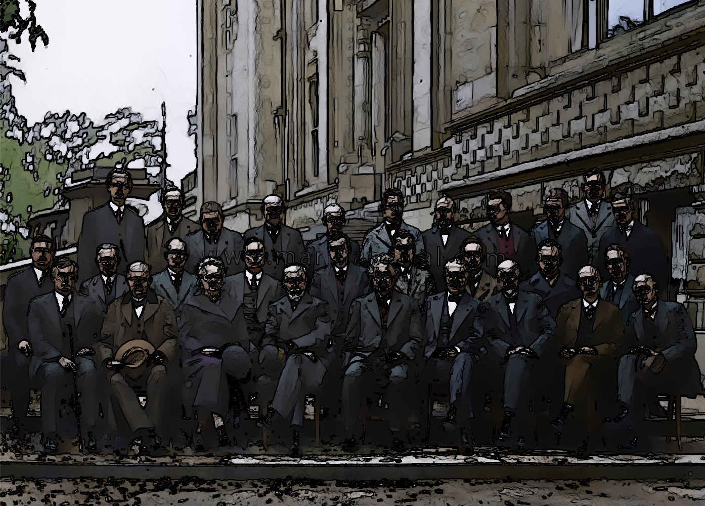
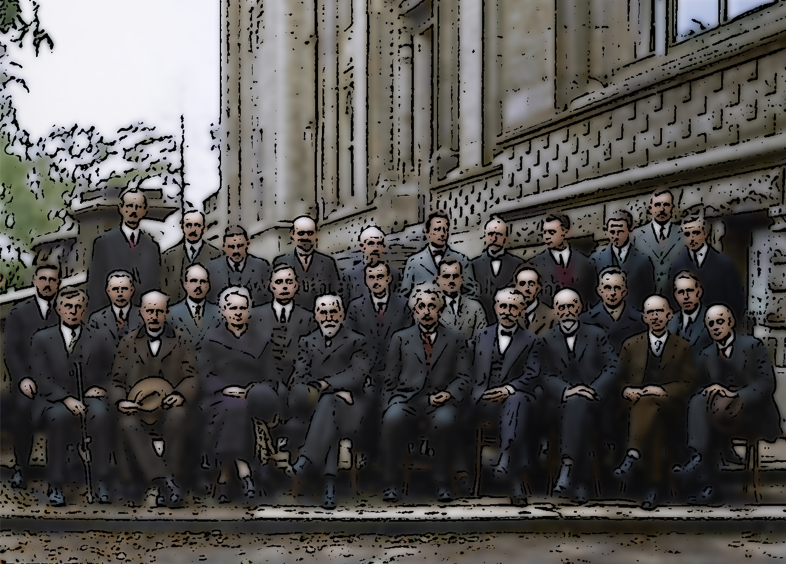

# cartoonize

opencv cartoonize practice

## Version

- Python: 3.9.16
- opencv-contrib-python: 4.7.0.72
- numpy: 1.24.1
- Matplotlib: 3.6.3

## Content

- threshold_edge
- blurring
- bit_and(self, degree=9, sigma=9)
- stylization(self, s=100, r=0.25)
- chatGPT recommendation

## Executions

<table>
  <tr>
    <td>My&nbsp;variation</td>
    <td>ChatGPT&nbsp;recommendation</td>
  </tr>
</table>
